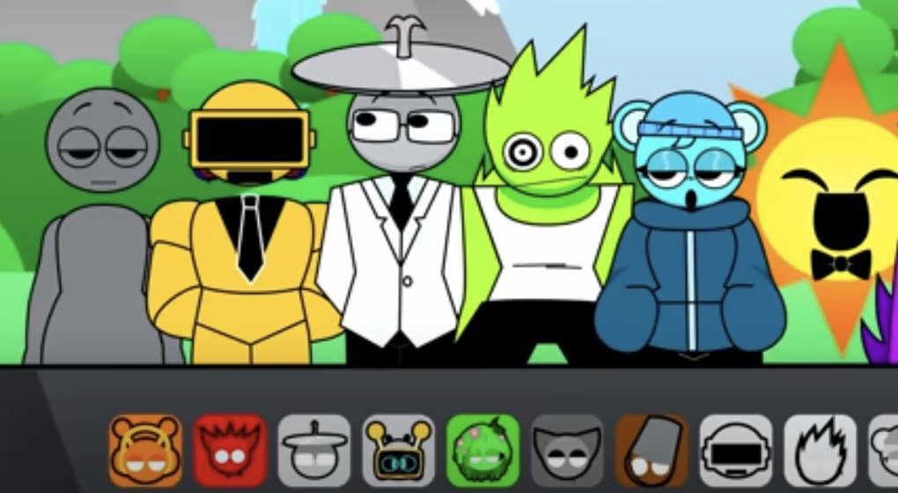

# Sprunki Grown Up 🎵

  

> An innovative music-mixing game that reimagines classic Sprunki characters in human form, offering a fresh musical creation experience!

## 🎮 Features

- 🎨 **Human Character Transformations**: Each classic character reimagined with unique human designs
- 🎬 **Dynamic Animations**: Lively character animations that bring music creation to life
- 🎵 **Musical Composition**: Create unique tracks by combining different characters
- 🎯 **Intuitive Gameplay**: Easy to learn mechanics suitable for all player types

## 🚀 Quick Start

1. Visit [Sprunki Grown Up](https://sprunkiretake.io/games/sprunki-grown-up)
2. Click "Start Playing"
3. Choose your favorite characters
4. Begin creating your music!

## 🎹 How to Play

In Sprunki Grown Up, you can:
- Combine different humanized characters to create music
- Explore various musical styles
- Experience vibrant animations
- Save and share your musical creations

## 💡 FAQ

Do I need musical experience?

No! The game is designed to be intuitive and accessible for everyone.

Is there a cost to play?

The game is completely free!

## 🌟 Player Reviews

> "The human transformations are incredible! The animations bring so much life to the game." - DesignLover

> "Sprunki Grown Up adds a whole new dimension to the game!" - AnimationFan

> "Each character feels distinct and adds so much personality." - CreativePlayer

